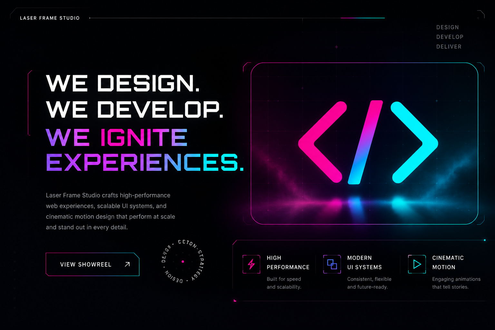
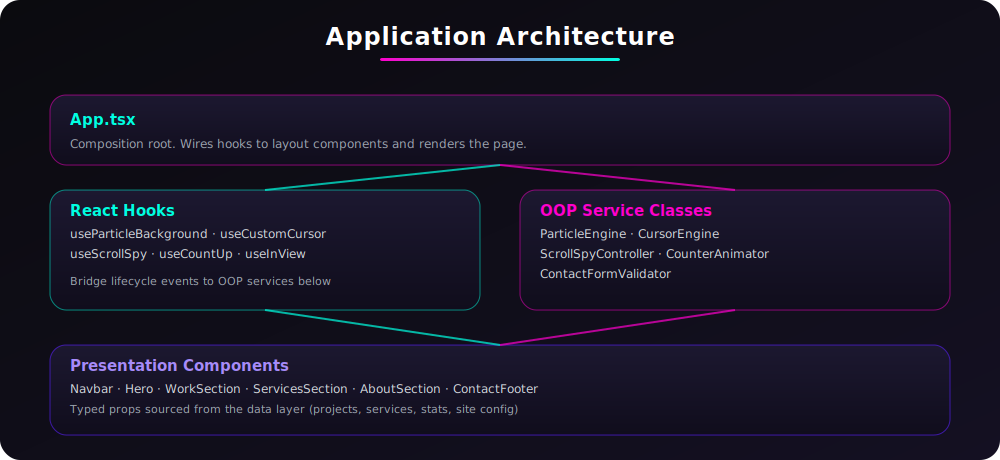
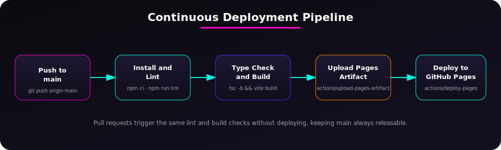

<div align="center">



# Laser Frame Studio

### React + TypeScript Rebuild &middot; Object-Oriented Architecture &middot; Automated GitHub Pages Deployment

[](https://github.com/OWNER/REPO/actions/workflows/deploy.yml)
[](https://github.com/OWNER/REPO/actions/workflows/ci.yml)


</div>

---

## Overview

This repository contains the full migration of the original Laser Frame Studio static site (HTML, CSS, and vanilla JavaScript) into a **TypeScript React application built around an object-oriented architecture**. Every piece of imperative behavior that used to live in a single `script.js` file, the particle field, the custom cursor, the scroll spy, the animated counters, now lives in a dedicated, testable class with a single responsibility. React hooks act as a thin bridge between those classes and the component tree.

The result is a codebase that is easier to extend, easier to reason about, and ready to ship through a fully automated CI/CD pipeline straight to GitHub Pages.

<div align="center">
  
</div>

---

## Table of Contents

- [What Changed From the Original Site](#what-changed-from-the-original-site)
- [New Features Added](#new-features-added)
- [Project Structure](#project-structure)
- [Object-Oriented Design](#object-oriented-design)
- [Getting Started](#getting-started)
- [Available Scripts](#available-scripts)
- [Deployment](#deployment)
- [Continuous Integration and Delivery](#continuous-integration-and-delivery)
- [Accessibility and Performance](#accessibility-and-performance)
- [Tech Stack](#tech-stack)
- [License](#license)

---

## What Changed From the Original Site

| Area | Before | After |
|---|---|---|
| Language | HTML, CSS, vanilla JavaScript | TypeScript, React 19, strict compiler settings |
| Structure | One `index.html`, one `script.js`, one `style.css` | Component tree, typed data layer, isolated service classes |
| Animation logic | Free functions inside a `DOMContentLoaded` callback | `ParticleEngine`, `CursorEngine`, `CounterAnimator`, `ScrollSpyController` classes |
| Content | Hardcoded markup | Typed content arrays (`projects.ts`, `services.ts`, `site.ts`) consumed by components |
| Deployment | Manual upload | GitHub Actions workflow building and publishing to GitHub Pages on every push to `main` |
| Quality gates | None | Lint and type-check enforced on every pull request |

No visual regressions were introduced. Colors, type, spacing, and the neon motion language of the original design system are preserved through the same CSS custom properties, now centralized in `src/styles/global.css`.

---

## New Features Added

While migrating, the following upgrades were layered on top of the original experience:

- **Validated contact form**: a new `ContactFormValidator` class enforces required fields and email format before opening a pre-filled email draft, replacing the old static `mailto` link.
- **Scroll progress bar**: a slim neon indicator pinned to the top of the viewport tracks reading progress across the page.
- **Active section navigation**: the navbar now highlights the link matching whatever section is currently in view, powered by `ScrollSpyController` and `IntersectionObserver`.
- **Back-to-top control**: appears once the visitor scrolls past the hero and returns them to the top with a smooth scroll.
- **Reduced motion support**: every animation respects `prefers-reduced-motion`, so the particle field and keyframe animations are automatically disabled for visitors who request less motion.
- **SEO and social metadata**: Open Graph and Twitter card tags were added so links shared on social platforms render a proper preview.
- **Typed content layer**: portfolio pieces, services, statistics, and navigation links are now data, not markup, so adding a new project card is a one-object change instead of an HTML edit.

---

## Project Structure

```
laser-frame-studio/
├── .github/workflows/       CI and CD pipeline definitions
├── docs/                    README diagrams and banner
├── public/                  Static assets copied as-is (favicon, banner)
├── src/
│   ├── components/          Presentational React components
│   ├── data/                 Typed content: projects, services, site config
│   ├── hooks/                React bridges into the OOP service layer
│   ├── services/             Framework-agnostic OOP classes
│   ├── styles/                Global stylesheet and design tokens
│   ├── types/                 Shared TypeScript interfaces
│   ├── App.tsx                Composition root
│   └── main.tsx                Application entry point
├── index.html
├── vite.config.ts
└── package.json
```

---

## Object-Oriented Design

Rather than porting the original `script.js` line by line into a component, each independent behavior was extracted into a class with a clear public API (`start()` and `stop()` in most cases) so React only needs to manage its lifecycle:

| Class | Responsibility |
|---|---|
| `ParticleEngine` | Owns the canvas render loop, the internal `Particle` pool, and resize handling for the animated background |
| `CursorEngine` | Tracks pointer position and applies the magnetic hover state to the custom cursor |
| `ScrollSpyController` | Observes section visibility and computes scroll progress percentage |
| `CounterAnimator` | Animates a numeric value from zero to a target over a fixed duration |
| `ContactFormValidator` | Stateless validation rules for the contact form, independent of any UI framework |

Each class is instantiated inside a corresponding hook (`useParticleBackground`, `useCustomCursor`, `useScrollSpy`, `useCountUp`) which handles mounting, cleanup, and re-render triggers. Components stay declarative and only consume the data the hooks expose.

<div align="center">
  
</div>

---

## Getting Started

### Prerequisites

- Node.js 20 or later (see `.nvmrc`)
- npm 10 or later

### Installation

```bash
git clone https://github.com/OWNER/REPO.git
cd REPO
npm install
```

### Local Development

```bash
npm run dev
```

The app will be available at `http://localhost:5173`.

---

## Available Scripts

| Command | Description |
|---|---|
| `npm run dev` | Starts the Vite development server with hot module replacement |
| `npm run build` | Type-checks the project and produces a production build in `dist/` |
| `npm run preview` | Serves the production build locally for a final check |
| `npm run lint` | Runs oxlint across the codebase |

---

## Deployment

This project deploys automatically to **GitHub Pages** using GitHub Actions. To enable it on a new repository:

1. Push this repository to GitHub.
2. In the repository settings, open **Pages** and set the source to **GitHub Actions**.
3. Push to `main`, or trigger the workflow manually from the **Actions** tab.
4. The site will be published at `https://<your-username>.github.io/<repository-name>/`.

The build uses a relative Vite `base` path (`./`), so no repository-name configuration is required inside the code.

---

## Continuous Integration and Delivery

Two workflows keep the project healthy:

- **`ci.yml`** runs on every pull request targeting `main`. It installs dependencies, lints, and runs a full type-checked build, so broken code never merges.
- **`deploy.yml`** runs on every push to `main`. It repeats the same checks, then uploads the `dist/` output as a Pages artifact and deploys it with the official `actions/deploy-pages` action.

---

## Accessibility and Performance

- Respects `prefers-reduced-motion` across canvas particles, keyframe animations, and transitions.
- Semantic landmarks (`nav`, `header`, `section`, `footer`) and labelled interactive controls throughout.
- The custom cursor and particle canvas are marked `aria-hidden` and automatically disabled on touch and small viewports.
- Scroll progress bar exposes `role="progressbar"` with live value attributes for assistive technology.
- Production build is a single-page static bundle with no runtime server dependency, so it serves instantly from a CDN edge.

---

## Tech Stack

```
Language      TypeScript (strict mode)
UI Library    React 19
Build Tool    Vite 8
Linting       oxlint
Deployment    GitHub Actions -> GitHub Pages
Design        CSS custom properties, Orbitron and Chakra Petch typefaces
```

---

## License

Released under the [MIT License](./LICENSE).

<div align="center">

**Laser Frame Studio**

*Architecting Interfaces. Engineering Motion. Delivering Excellence.*

</div>
