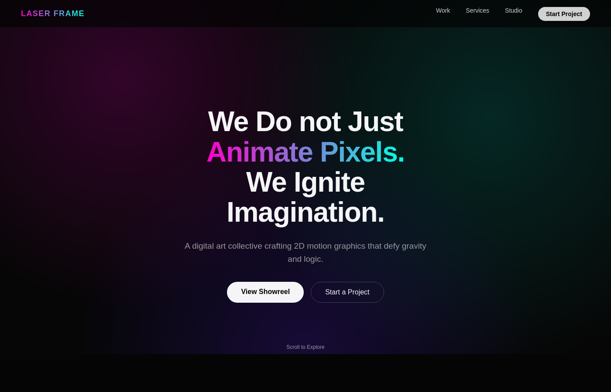
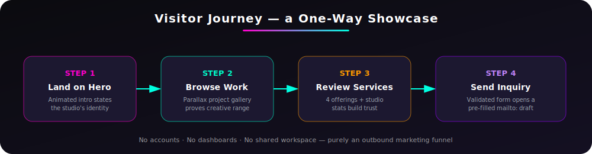
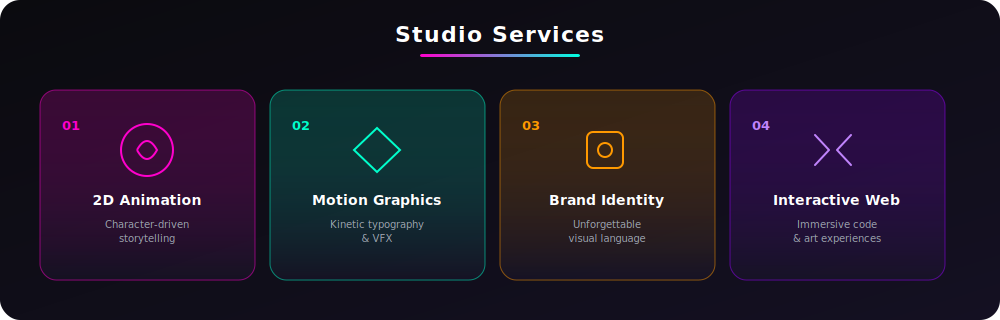

# ⚡ LASER FRAME STUDIO

### A single-page digital showcase for a motion-design & animation studio

---

## 🎬 What This Site Is

**Laser Frame Studio** is the public-facing website for a fictional digital art collective specializing in **2D animation, motion graphics, brand identity, and interactive web experiences**. It is not a tool, a platform, or a collaborative workspace — it is a **cinematic, single-serving marketing site**: one continuous scroll that introduces the studio, proves its craft through a project gallery, states its services, and converts an interested visitor into an email inquiry.

There are no accounts, no logins, no dashboards, and nothing to install for an end user. The entire "service" the site provides is **presentation and lead capture**.

 
<i>Recreated first-view (hero) of the live site, rendered from the project's own design tokens.</i>

---

## 🧭 Visitor Journey

The site is intentionally **linear and one-directional** — every section exists to move a visitor one step closer to sending a message. There is no shared state, no multi-user feature, and nothing to "collaborate" on.

| Stage | Section | Purpose |
|---|---|---|
| 👁️ **Arrive** | `Hero` | Full-viewport animated statement of identity, with call-to-action buttons |
| 🎞️ **Explore** | `Work` | Parallax-driven gallery of past projects, each with generative gradient artwork |
| 🧩 **Evaluate** | `Services` | Four core offerings presented as an indexed capability list |
| 📊 **Trust** | `Studio / About` | Studio narrative plus animated counters (projects, awards, years) |
| ✉️ **Convert** | `Contact` | Validated form that opens a pre-filled `mailto:` draft — no backend, no data storage |

---

## 🛠️ What the Site Offers (Service Catalogue)

| # | Service | Description |
|---|---|---|
| 01 | **2D Animation** | Fluid, character-driven storytelling that brings static concepts to life |
| 02 | **Motion Graphics** | High-impact visual effects and kinetic typography for digital platforms |
| 03 | **Brand Identity** | Visual languages designed to resonate and remain unforgettable |
| 04 | **Interactive Web** | Immersive web experiences that blend code and art |

These four cards are the entire commercial offering communicated on the page — the site's job is to make each one feel tangible before the visitor ever speaks to a human.

---

## ✨ Experience Highlights

| Feature | What It Does |
|---|---|
| 🌌 **Particle Background** | Canvas-driven ambient particle field rendered behind all content |
| 📈 **Scroll Progress Bar** | Fixed top-of-viewport indicator tracking scroll depth through the page |
| 🔢 **Animated Stat Counters** | Studio metrics (projects, awards, years) count up into view on scroll |
| 🖱️ **Custom Cursor Engine** | Cursor states react to hoverable elements for a more tactile feel |
| 🧭 **Scroll-Spy Navigation** | Nav links highlight automatically as the matching section enters view |
| 🎨 **Generative Project Art** | Each portfolio piece renders unique SVG gradient artwork, no image assets required |
| ⬆️ **Back-to-Top Control** | Appears after scroll threshold for fast return to the hero |
| ✅ **Client-Side Form Validation** | Contact form is validated before handing off to the visitor's own mail client |

---

## 🏗️ How It's Built

The front end is intentionally engineered like a small application rather than a static template: presentation components stay dumb, while animation and interaction logic live in dedicated, unit-testable OOP service classes wired in through React hooks.

**Layer breakdown**

- **`App.tsx`** — composition root; assembles the page from layout components
- **Hooks** (`useParticleBackground`, `useCustomCursor`, `useScrollSpy`, `useCountUp`, `useInView`) — bridge React lifecycle events to the service layer
- **Services** (`ParticleEngine`, `CursorEngine`, `ScrollSpyController`, `CounterAnimator`, `ContactFormValidator`) — framework-agnostic classes that own all animation/validation logic
- **Components** (`Navbar`, `Hero`, `WorkSection`, `ServicesSection`, `AboutSection`, `ContactFooter`, …) — typed, presentation-only, driven by the data layer
- **Data** (`site.ts`, `projects.ts`, `services.ts`) — all copy, project metadata, and studio config in one typed source of truth

---

## 🚀 Delivery Pipeline

The site ships automatically: every pull request is linted and type-checked, and every merge to `main` is built and deployed as a static bundle.

---

## 🧬 Tech Stack

No backend, no database, and no third-party analytics are part of the served experience — everything a visitor interacts with runs client-side in the browser, and the contact "submission" hands off to the visitor's own email client rather than storing anything server-side.

---

## 🎨 Design Language

| Token | Value | Swatch |
|---|---|---|
| Background | `#050505` |  |
| Accent — Magenta | `#ff00cc` |  |
| Accent — Violet | `#5b21ff` |  |
| Accent — Cyan | `#00ffe1` |  |
| Accent — Amber | `#ff8a00` |  |

Display type is set in **Orbitron** for headings and **Inter** for body copy, reinforcing a high-contrast, neon-on-black studio identity throughout every section.

---

**Laser Frame Studio** — *We do not just animate pixels. We ignite imagination.*

© Laser Frame Studio · All rights reserved · This repository is proprietary and is not licensed for reuse.

